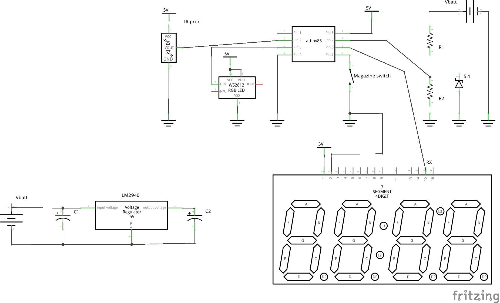

Rapidtronic
========

A NERF Rapidstrike rifle augmented with sensors, a display and an Attiny85 as controller.

Features
------

 * Battery voltage measurement on 7-segment display
 * Status RGB Led
 * Magazine detection (yellow signal on magazine missing)
 * Low ammo level in attached magazine (red signal if the magazine is present)
 * Low battery voltage detection (purple signal)

Parts
------

 * 1x Attiny85 (fused @ 8MHz)
 * 1x DIP-8 socket
 * 1x WS2812 pre-mounted RGB LED
 * 1x IR proximity sensor module (a.k.a. a line hunting sensor from ebay)
 * 2x 1% resistors for voltage divider: R1=37KOhm and R2=9KOhm
 * 1x 5.1V Zener (voltage divider safety)
 * 1x 5V voltage regulator: LM2940
 * 2x filtering capacitors for the regulator: C1=1uF and C2=1mF
 * 1x Sparfun Serial 7-segment display
 * A solder, tin, 22-awg stranded and solid wire, patience

Schematic
------

Image gallery
------

[Here] (http://imgur.com/a/zSusg#0)

Video demo
------

Licence
------

This software contains code released under the GPLv2 and the Beerware licence. Hence, I release everything under the GPLv2 as well.
